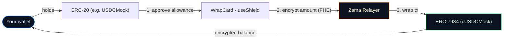
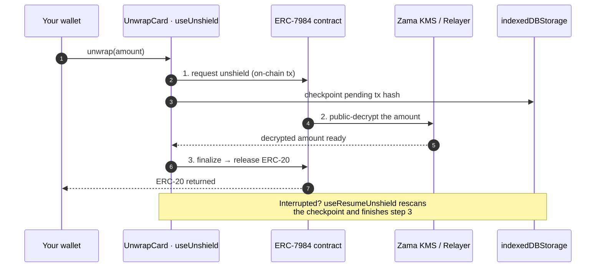
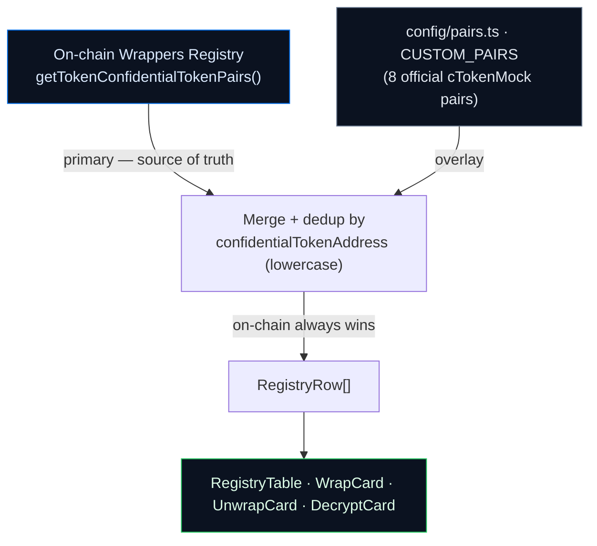
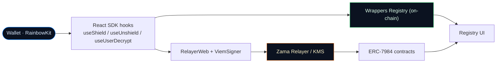

<p align="center">
  
</p>

# Wrapline — Confidential Wrapper Registry

> The official **Zama Wrappers Registry**, turned into a usable product. Browse every
> ERC-20 ↔ ERC-7984 wrapper pair on **Sepolia** and **Ethereum mainnet**, wrap and unwrap
> any pair, decrypt any ERC-7984 balance through the **EIP-712 user-decryption** flow, and
> claim Sepolia test tokens from a built-in faucet.

- **Live app:** https://wrapline.vercel.app/
- **Networks:** Ethereum Sepolia (testnet) · Ethereum Mainnet
- **Built for:** Zama Developer Program — Season 3, Bounty Track

**Jump to:** [Registry sourcing](#hybrid-registry-sourcing) · [Add a new pair](#registering-a-new-pair-on-chain) · [Deployment & scripts](#deployment) · [Contract addresses](#registry--contract-addresses)

---

## Introduction

Wrapline isn't another confidential-token demo — it's the missing product layer on top of the
canonical **Zama Wrappers Registry**. The registry already lists the official ERC-20 ↔ ERC-7984
pairs, but developers keep spinning up their own look-alike test tokens and wrappers instead of
using it. That fragments the ecosystem: integrations stop composing, and users end up holding
confidential assets that only *look* like the real thing.

Wrapline makes the canonical pairs the **path of least resistance**. It reads the on-chain
registry as its source of truth, wraps ERC-20s into their confidential ERC-7984 counterparts
using Fully Homomorphic Encryption (FHE), unwraps them back through Zama's asynchronous
KMS decryption, and reveals any encrypted balance you hold via the EIP-712 user-decryption
handshake — all from a single dApp, on both Sepolia and Ethereum mainnet.

Balances live encrypted on a public chain. Verifiability stays public. Decryption stays yours.
No bridge, no custodian, no trusted indexer — the registry contract is the only authority, and
everything Wrapline shows is either read from it live or declared in a transparent local overlay.

Wrapline is where a confidential token layer stops being a protocol primitive and starts being
something a person can actually *use*.

---

## How It Works

### Wrap flow — ERC-20 → ERC-7984



The plaintext amount is encrypted client-side before it ever touches the chain. Only the
confidential ERC-7984 balance lands on-chain — the public sees a ciphertext handle, not a number.

### Unwrap flow — asynchronous KMS decryption (resumable)

Unwrapping an ERC-7984 back to its ERC-20 is a **three-step asynchronous** dance, because the
plaintext amount has to be revealed by Zama's Key Management Service before the contract can
release the underlying tokens. Wrapline checkpoints every step so an interrupted unwrap can be
resumed — even on another device.



### Hybrid registry sourcing



The on-chain registry is authoritative. The local overlay only fills gaps for pairs not yet
registered on-chain — and the moment a pair appears on-chain, its overlay entry is silently
dropped by the dedup step. Metadata, `isValid`, and addresses are read live; nothing is trusted
blindly.

---

## What Wrapline Does

Each panel is a focused capability, not a kitchen-sink form. Every one funnels its errors through
a single `humanizeError()` translator and is gated behind a post-mount readiness check so the FHE
SDK never runs before its provider exists.

### Registry Browser

> *"Show me every canonical pair on both chains, and tell me which ones are still valid."*

Reads the on-chain Wrappers Registry on **Sepolia and Mainnet simultaneously** and merges each
with the local overlay. Deprecated pairs (`isValid: false`) are shown dimmed with a badge rather
than hidden, so the browse view stays honest.

- **File**: [`components/RegistryTable.tsx`](./components/RegistryTable.tsx) · hook `useAllChainsPairs` in [`lib/registry.ts`](./lib/registry.ts)

### Wrap

> *"Take my ERC-20 and give me its confidential ERC-7984 twin."*

Handles the full path: claim test tokens from the faucet, approve the ERC-20 allowance, then
`useShield` to encrypt the amount and wrap. Pre-flight guards catch missing allowance and
insufficient balance before you spend gas.

- **File**: [`components/WrapCard.tsx`](./components/WrapCard.tsx) · hook `useShield`

### Unwrap (asynchronous, resumable)

> *"Turn my confidential balance back into the underlying — and don't lose my place if I refresh."*

Drives the three-step request → KMS public-decrypt → finalize flow with a live stepper, a resume
drawer for interrupted unwraps, and a **cross-device recovery** form (paste a pending tx hash +
pick the token to finish an unwrap started elsewhere).

- **File**: [`components/UnwrapCard.tsx`](./components/UnwrapCard.tsx) · hooks `useUnshield`, `useResumeUnshield`

### Decrypt any ERC-7984

> *"Reveal my encrypted balance for any confidential token — not just the ones in the registry."*

The EIP-712 user-decryption flow. Reveals registry-token balances and **arbitrary paste-an-address
ERC-7984s** (validated with `useIsConfidential` first), plus an auto-detect scan across registry
tokens for non-zero balances. The first reveal prompts one signature; the session key is cached.

- **File**: [`components/DecryptCard.tsx`](./components/DecryptCard.tsx) · hooks `useUserDecrypt`, `useConfidentialBalance`, `useIsConfidential`

### Sepolia Faucet

> *"Give me test tokens to actually try this."*

Mints the official `cTokenMock` underlying ERC-20s (`mint(address,uint256)`), then hands off to
Wrap. Optionally probes each token's per-address mint cap and disables the button when you've hit
it — degrading silently on tokens that don't expose the cap functions.

- **File**: [`lib/erc20.ts`](./lib/erc20.ts) (`erc20MintableAbi`, `erc20CapAbi`, `FAUCET_AMOUNT`)

### Network Switching

> *"Sepolia for testing, Mainnet for the real registry — and warn me if I'm on the wrong chain."*

Sepolia ↔ Mainnet switching, with a banner that fires on unsupported chains and an in-card
"Switch to Sepolia" prompt on the testnet-only faucet.

- **File**: [`components/NetworkBanner.tsx`](./components/NetworkBanner.tsx)

### Feature matrix

| Capability | Sepolia | Mainnet |
|---|:-:|:-:|
| Browse registry | ✓ | ✓ |
| Wrap (ERC-20 → ERC-7984) | ✓ | ✓ |
| Unwrap (async, resumable) | ✓ | ✓ |
| Decrypt (EIP-712 user-decryption) | ✓ | ✓ |
| Paste-address / auto-detect decrypt | ✓ | ✓ |
| Faucet (mint test ERC-20s) | ✓ | — (testnet only) |

---

## Key Features

- **Hybrid registry**: on-chain Wrappers Registry as source of truth, merged with a transparent
  local overlay and deduped by confidential-token address — on-chain always wins.
- **Dual-chain reads**: the browse view reads Sepolia *and* Mainnet at once via direct contract
  calls with explicit `chainId`, independent of the connected wallet chain.
- **EIP-712 user-decryption**: reveal any ERC-7984 balance you hold with one cached signature —
  registry tokens *and* arbitrary pasted addresses.
- **Asynchronous unwrap with resume**: three-step request → KMS decrypt → finalize, checkpointed
  to IndexedDB so an interrupted unwrap can be finished — including **cross-device recovery** from
  a pasted tx hash.
- **Built-in faucet with cap probe**: mint official `cTokenMock` ERC-20s; optionally read the
  per-address mint cap and degrade silently where it isn't exposed.
- **Humanized errors**: every panel routes failures through one `humanizeError()` translator that
  walks the error `cause` chain and maps reverts to plain English (allowance, balance, chain
  mismatch, non-ERC-7984, relayer/KMS, faucet cap, user-rejection…).
- **SSR-safe FHE provider**: the Zama SDK is withheld until the relayer and signer are ready and
  the component has mounted — the SDK's hooks can never fire on the server or before init.
- **`ViemSigner`, not `WagmiSigner`**: deliberately wired to keep the locked wagmi v2 + RainbowKit
  v2 stack intact (the shim targets wagmi v3).

---

## Architecture & Data Flow

### Provider stack

```
WagmiProvider → QueryClientProvider → RainbowKitProvider → FheProvider (ZamaProvider)
```

`FheProvider` ([`app/app/providers.tsx`](./app/app/providers.tsx)) constructs a `RelayerWeb`
once (stable across renders) and a `ViemSigner` that rebuilds on wallet/chain change, then
withholds `ZamaProvider` until `mounted && relayer && signer`.

### Registry data layer

Two hooks in [`lib/registry.ts`](./lib/registry.ts), by scope:

| Hook | Used by | Chain scope |
|------|---------|-------------|
| `useRegistryPairs()` | WrapCard, UnwrapCard, DecryptCard | Active wallet chain only (SDK `useListPairs`) |
| `useAllChainsPairs()` | RegistryTable | Sepolia + Mainnet at once (wagmi `useReadContract`, explicit `chainId`) |

Both merge on-chain results with `CUSTOM_PAIRS`, deduped by lowercase `confidentialTokenAddress`.
`useRegistryPairs` returns both `rows` (all) and `validRows` (filtered `isValid: true`) — action
panels use `validRows`, the browse table uses `rows`.

### End-to-end data flow



---

## How Wrapline Uses Zama FHE

Wrapline is built on Zama's FHE stack end-to-end — the React SDK, the Relayer, the KMS, the
ERC-7984 standard, and the canonical Wrappers Registry. Every layer touches real Zama
infrastructure.

### 1. Relayer SDK — `RelayerWeb` + `ViemSigner`

The FHE provider builds a stable relayer and a signer wired to wagmi's live viem clients. We use
the SDK's `ViemSigner` deliberately — the `WagmiSigner` shim imports a wagmi-v3-only export that
breaks the locked v2 stack:

```tsx
// app/app/providers.tsx
const relayer = useMemo(() => {
  if (typeof window === "undefined") return null;
  return new RelayerWeb({
    getChainId: async () => getChainId(wagmiConfig),
    transports: {
      [sepolia.id]: { ...SepoliaConfig, ...(SEPOLIA_RPC ? { network: SEPOLIA_RPC } : {}) },
      [mainnet.id]: { ...MainnetConfig, ...(MAINNET_RPC ? { network: MAINNET_RPC } : {}) },
    },
  });
}, []);

// ViemSigner rebuilt on wallet/chain change so network switching stays transparent.
const signer = useMemo(
  () => new ViemSigner({ publicClient, walletClient, ethereum }),
  [publicClient, walletClient]
);
```

### 2. ERC-7984 confidential tokens — `useShield` / `useUnshield`

Wrapping and unwrapping go through the React SDK's ERC-7984 hooks. `useShield` encrypts the amount
client-side and wraps; `useUnshield` drives the asynchronous request → KMS decrypt → finalize flow.

### 3. EIP-712 user-decryption — `useUserDecrypt`

Revealing an encrypted balance is a user-decryption handshake: the SDK requests a decryption of a
ciphertext handle, the wallet signs an EIP-712 payload once, and the session key is cached for
subsequent reveals. Works for registry tokens and any pasted ERC-7984 address.

### 4. KMS public-decrypt — the async unwrap middle step

Unwrapping can't be synchronous: the underlying amount must be revealed by Zama's KMS before the
ERC-7984 contract releases the ERC-20. Wrapline checkpoints the pending request to IndexedDB and
finalizes once the KMS decryption is ready — resumable via `useResumeUnshield`.

### 5. Wrappers Registry — `getTokenConfidentialTokenPairs()`

The registry contract is the source of truth. Wrapline reads it via a minimal ABI and, for the
browse view, calls it directly per-chain to bypass the SDK's active-chain restriction:

```ts
// config/pairs.ts
export const WRAPPERS_REGISTRY_ABI = [{
  name: "getTokenConfidentialTokenPairs",
  type: "function",
  stateMutability: "view",
  inputs: [],
  outputs: [{ type: "tuple[]", components: [
    { name: "tokenAddress", type: "address" },
    { name: "confidentialTokenAddress", type: "address" },
    { name: "isValid", type: "bool" },
  ]}],
}] as const;
```

The hybrid merge keeps on-chain data authoritative:

```ts
// lib/registry.ts — on-chain wins; overlay only fills gaps
const seen = new Set(onchain.map((row) => row.confidentialTokenAddress.toLowerCase()));
const custom = customPairsForChain(chainId)
  .filter((pair) => !seen.has(pair.confidentialTokenAddress.toLowerCase()));
```

### 6. `indexedDBStorage` — pending-unwrap checkpoints

`ZamaProvider` is given the SDK's `indexedDBStorage`, so pending unwrap requests survive a page
reload. Because IndexedDB is origin-scoped, cross-device resume is done explicitly via the paste-a-
tx-hash recovery form.

---

## Technical Foundation

**1. Hybrid registry merge.** On-chain pairs and the local overlay are normalized into one
`RegistryRow[]` and deduped by lowercase `confidentialTokenAddress`. On-chain entries always win;
overlay entries are a safety net for pairs awaiting registration. `useRegistryPairs` exposes both
`rows` and `validRows` so action panels never offer a deprecated pair while the browse table can
still display it with a badge.

**2. Error humanization.** `humanizeError()` ([`lib/errors.ts`](./lib/errors.ts)) flattens an
error and walks its `cause` chain up to four levels deep, then matches ordered, most-specific-first
patterns — user-rejection, chain mismatch, gas, allowance, balance, non-ERC-7984, relayer/KMS,
faucet cap — before falling back to a truncated generic revert.

**3. SSR-safe, post-mount gating.** The Zama SDK never renders on the server. `FheProvider`
withholds `ZamaProvider` until `mounted && relayer && signer`, and every action card renders a
skeleton until mounted — so no SDK hook can fire before the provider exists.

**4. Faucet cap probe.** `erc20CapAbi` optionally reads `MAX_AMOUNT_PER_ADDRESS()` and
`mintedAmount(address)` with `retry: false`; tokens that don't implement them degrade silently
instead of erroring.

**5. Dual-chain, indexer-free reads.** The browse view issues two `useReadContract` calls with
explicit `chainId` (Sepolia + Mainnet) plus a batched metadata read with `allowFailure: true` — no
indexer, no trusted middleman, just the registry contract on each chain.

---

## Registry & Contract Addresses

**Wrappers Registry** (source of truth):

| Chain | Registry address |
|---|---|
| Ethereum Sepolia | `0x2f0750Bbb0A246059d80e94c454586a7F27a128e` |
| Ethereum Mainnet | `0xeb5015fF021DB115aCe010f23F55C2591059bBA0` |

**Official Zama Sepolia cTokenMock pairs** (`config/pairs.ts`) — hardcoded overlay, deduped out
whenever the same pair is present on-chain:

| Symbol | Underlying ERC-20 | Confidential ERC-7984 | Decimals |
|---|---|---|:-:|
| USDCMock | `0x9b5Cd13b8efBB58DC25A05Cf411D8056058aDFFF` | `0x7c5BF43B851c1dff1a4feE8dB225b87f2C223639` | 6 |
| USDTMock | `0xa7Da08fAFDC9097cC0E7d4f113a61e31D7e8E9b0` | `0x4E7B06D78965594eB5EF5414c357ca21E1554491` | 6 |
| WETHMock | `0xFF54739B16576Fa5402f211D0b938469aB9A5f3F` | `0x46208622DA27d91db4f0393733C8BA082ed83158` | 18 |
| BRONMock | `0xFF021FB13Ca64E5354c62c954b949A88cFdeb25E` | `0xaa5612FA27c927a0c7961f5AEFEE5ba3A0F9C891` | 18 |
| ZAMAMock | `0x75355a85C6fb9DF5F0c80ff54e8747EEe9A0BF57` | `0xf2D628d2598aF4eAF94CB76a437Ff86CA78FfbFB` | 18 |
| tGBPMock | `0x93c931278A2Aad1916783f952f94276eA5111442` | `0xfCE5c7069c5525eF6c8C2b2E35A745bA20a2F7CC` | 18 |
| XAUtMock | `0x24377ae4AA0C45ECEE71225007F17c5d423DD940` | `0xe4FcF848739845BC81Dee1d5352cf3844F0a60C7` | 6 |
| tGBP | `0xF6eF9AdB61a48E29e36bc873070a46a3D2667fF3` | `0x167DC962808B32CFFFc7e14B5018c0bE06A3A208` | 18 |

---

## Quick Start

### Prerequisites

- Node.js 18+ and [pnpm](https://pnpm.io/)
- A browser wallet (MetaMask or any injected/WalletConnect wallet)
- [Foundry](https://book.getfoundry.sh/) (`cast`) — only for on-chain pair registration

### Installation

```bash
git clone https://github.com/Sarnav07/Wrapline.git
cd Wrapline

pnpm install
cp .env.example .env.local   # all values optional for local dev
pnpm dev                     # http://localhost:3000
```

### Environment variables

All optional for local development — injected wallets work without a WalletConnect id, and public
RPCs are used as fallback.

| Variable | Required | Purpose |
|----------|----------|---------|
| `NEXT_PUBLIC_WC_PROJECT_ID` | for WalletConnect | RainbowKit / WalletConnect project id ([cloud.reown.com](https://cloud.reown.com)). Injected wallets work without it. |
| `NEXT_PUBLIC_SEPOLIA_RPC_URL` | optional | Custom Sepolia RPC (falls back to a public endpoint). |
| `NEXT_PUBLIC_MAINNET_RPC_URL` | optional | Custom Mainnet RPC (falls back to a public endpoint). |

### Scripts

```bash
pnpm dev      # dev server at http://localhost:3000
pnpm build    # production build (also type-checks)
pnpm start    # serve the production build
pnpm lint     # eslint
```

### Deployment

The app is a standard Next.js 14 app and deploys on **Vercel** with zero extra config —
`pnpm build` is the build command, no server runtime is required (both routes are static).
The three environment variables above are **all optional**: injected wallets and public RPC
fallbacks make the deployment work even with none set. Set them in the Vercel project only to
enable WalletConnect (`NEXT_PUBLIC_WC_PROJECT_ID`) and custom RPCs.

The only ops script is [`scripts/register-pair.sh`](./scripts/register-pair.sh) — a Foundry
(`cast`) helper that registers a new ERC-20 ↔ ERC-7984 pair on the on-chain Wrappers Registry
(see below). There is no separate deploy script; the frontend deploy is the Vercel build.

### Registering a new pair on-chain

`scripts/register-pair.sh` calls `registerConfidentialToken(address,address)` on the deployed
Wrappers Registry via Foundry's `cast`. Run it from the account that owns the wrapper contract:

```bash
PRIVATE_KEY=0x…      \
ERC20_ADDRESS=0x…    \
WRAPPER_ADDRESS=0x…  \
bash scripts/register-pair.sh

# Mainnet:
CHAIN=mainnet PRIVATE_KEY=0x… ERC20_ADDRESS=0x… WRAPPER_ADDRESS=0x… bash scripts/register-pair.sh
```

Once the tx confirms, the pair appears in Wrapline automatically — no code change required. To add
a pair *without* registering it on-chain (local/dev), add an entry to
[`config/pairs.ts`](./config/pairs.ts) — see the `CustomPair` example at the top of that file.

---

## Verification

Wrapline has **no automated test suite** — verification is `pnpm build` (which type-checks the
whole app) plus manual QA against a live Sepolia wallet.

```bash
pnpm build          # production build + full TypeScript type-check
pnpm lint           # eslint
```

Manual QA checklist (connect a wallet on **Sepolia**):

1. **Registry** — browse loads pairs on Sepolia and Mainnet; deprecated pairs show a badge.
2. **Faucet** — mint a `cTokenMock` ERC-20; cap-limited tokens disable the button at the cap.
3. **Wrap** — approve, then wrap; the confidential balance shows as a ciphertext.
4. **Decrypt** — reveal a balance via EIP-712 (one signature), plus a pasted arbitrary ERC-7984.
5. **Unwrap** — run the three-step flow; refresh mid-flow and confirm the resume drawer finishes it.
6. **Network** — switch to Mainnet; the faucet shows "Switch to Sepolia"; an unsupported chain
   triggers the network banner.

---

## Reference

- **Zama Protocol docs (ERC-7984, confidential tokens)**: <https://docs.zama.ai/protocol>
- **Zama Relayer SDK guides**: <https://docs.zama.ai/protocol/relayer-sdk-guides>
- **Zama FHE (fhEVM)**: <https://www.zama.ai/>
- **Wrappers Registry (Sepolia)**: [`0x2f0750Bbb0A246059d80e94c454586a7F27a128e`](https://sepolia.etherscan.io/address/0x2f0750Bbb0A246059d80e94c454586a7F27a128e)
- **Wrappers Registry (Mainnet)**: [`0xeb5015fF021DB115aCe010f23F55C2591059bBA0`](https://etherscan.io/address/0xeb5015fF021DB115aCe010f23F55C2591059bBA0)

---

## Tech Stack

- **Next.js 14** (App Router, TypeScript) · **Tailwind CSS**
- **wagmi 2 + viem 2 + RainbowKit 2** — wallet connection + network switching (versions pinned)
- **@zama-fhe/react-sdk 3 + @zama-fhe/sdk 3 + @tanstack/react-query 5** — FHE encrypt /
  user-decrypt / public-decrypt, registry discovery, wrap/unwrap, balances
- **three + @react-three/fiber / drei** — the landing-page point-cloud globe
- Deployed on **Vercel**

> The FHE signer is built with the SDK's `ViemSigner` (fed wagmi's live viem clients) rather than
> the `WagmiSigner` shim, which targets wagmi v3 and conflicts with RainbowKit's wagmi-v2 peer
> requirement.

---

## Development Team

- [@Sarnav07](https://github.com/Sarnav07)
- [@vihaan1016](https://github.com/vihaan1016)

---

## License

MIT.

---

**Built for the Zama Developer Program — Season 3, Bounty Track. Confidential by default,
verifiable by design.**
